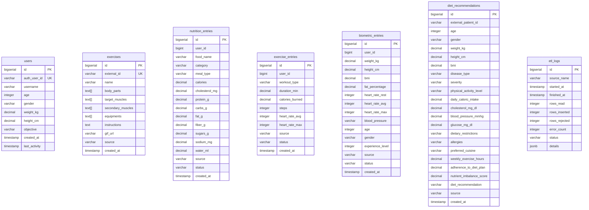

# MSPR HealthAI Coach - BDD

Microservice base de donnees PostgreSQL 16 pour la plateforme HealthAI Coach.

Ce depot contient uniquement les migrations SQL. Il ne depend d'aucun autre microservice.
Le runtime (Docker) est gere par le `docker-compose.yml` a la racine du monorepo.

## Demarrage

```bash
# Depuis la racine du monorepo
docker compose up -d db
```

Le service est pret quand le healthcheck passe (`healthy`).

## Migrations

Les migrations SQL sont dans `migrations/` et sont executees automatiquement au premier demarrage via `docker-entrypoint-initdb.d`.

| Fichier | Contenu |
|---------|---------|
| `V1__init_schema.sql` | Schema principal : users, exercises, nutrition_entries, exercise_entries, biometric_entries, etl_logs |
| `V2__diet_recommendations.sql` | Table diet_recommendations |
| `V3__add_unique_constraints.sql` | Contraintes d'unicite pour les ON CONFLICT |
| `V4__split_auth_from_profile.sql` | Separation auth : suppression email/password_hash/role/is_premium, ajout auth_user_id |
| `V5__remove_user_fk_constraints.sql` | Suppression des FK user_id sur les tables ETL (datasets heterogenes) |
| `V6__add_demographics_to_biometric_entries.sql` | Ajout age, gender, experience_level dans biometric_entries |
| `V7__etl_logs_details_jsonb.sql` | Conversion de etl_logs.details de TEXT vers JSONB |

## Reseau Docker

Le reseau `mspr_data_network` est cree par le compose racine.
Pour connecter un service externe :

```yaml
networks:
  mspr_data_network:
    external: true
```

## Connexion directe

```
host: localhost
port: 5432
database: healthai
user: healthai_user
```

## Export des donnees nettoyees

Le script `scripts/export_clean_data.sh` exporte toutes les tables en CSV (une fois l'ETL execute).
L'API lit directement PostgreSQL — les CSV sont uniquement des livrables pour les data scientists.

```bash
./scripts/export_clean_data.sh ./exports
# Genere exports/users.csv, exports/exercises.csv, etc.
```

## Schema de la base de donnees



Tables independantes (pas de FK) : `exercises`, `diet_recommendations`, `etl_logs`, `nutrition_entries`, `exercise_entries`, `biometric_entries`.
