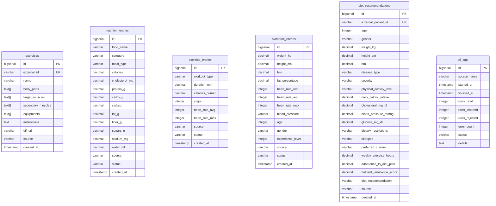

# MSPR HealthAI Coach - BDD

Microservice base de donnees PostgreSQL 17 pour la plateforme HealthAI Coach.

Ce depot contient uniquement les migrations SQL. Il ne depend d'aucun autre microservice.
Le runtime (Docker) est gere par le `docker-compose.yml` a la racine du monorepo.

## Demarrage

```bash
# Depuis la racine du monorepo
docker compose up -d db
```

Le service est pret quand le healthcheck passe (`healthy`).

## Migrations

Les migrations SQL sont dans `migrations/` et sont executees automatiquement au premier demarrage via `docker-entrypoint-initdb.d`.

| Fichier | Contenu |
|---------|---------|
| `V1__init_schema.sql` | Schema principal : users, exercises, nutrition_entries, exercise_entries, biometric_entries, etl_logs + index |
| `V2__diet_recommendations.sql` | Table diet_recommendations |
| `V3__add_unique_constraints.sql` | Contraintes UNIQUE NULLS NOT DISTINCT pour les ON CONFLICT |
| `V4__fix_nutrition_schema.sql` | Ajout colonne carbsg dans nutrition_entries (copie depuis carbs_g) |
| `V5__add_missing_columns.sql` | Ajout age (IF NOT EXISTS) dans biometric_entries |
| `V6__biometric_add_demographics.sql` | Ajout gender, experience_level (IF NOT EXISTS) dans biometric_entries |
| `V7__drop_users_table.sql` | Suppression de la table users et des FK user_id (datasets sources anonymises) |
| `V8__ai_nutrition_tables.sql` | Tables AI-Nutrition (MSPR2) : meal_analyses, meal_plans, nutrition_goals + index |
| `V9__ai_nutrition_enrichment.sql` | Enrichissement AI-Nutrition : nutrition_goals.health_goal (CHECK), meal_plans.inputs_hash (cache LLM) + index, meal_analyses.recommendations JSONB |

## Reseau Docker

Le reseau `mspr_data_network` est cree par le compose racine.
Pour connecter un service externe :

```yaml
networks:
  mspr_data_network:
    external: true
```

## Connexion directe

Depuis la machine hote (port mappe) :

```
host: localhost
port: 5434
database: healthai
user: healthai_user
```

Depuis un autre conteneur du reseau `mspr_data_network` :

```
host: mspr-healthai-db
port: 5432
database: healthai
user: healthai_user
```

## Export des donnees nettoyees

Le script `scripts/export_clean_data.sh` exporte toutes les tables en CSV (une fois l'ETL execute).
L'API lit directement PostgreSQL — les CSV sont uniquement des livrables pour les data scientists.

```bash
./scripts/export_clean_data.sh ./exports
# Genere exports/users.csv, exports/exercises.csv, etc.
```

## Modele de donnees

Le modele relationnel complet (ERD MSPR1 + MSPR2, tableau des migrations V8/V9, justifications du retrait des FK `user_id`, du choix `JSONB` et de la strategie `inputs_hash`) est documente dans [`docs/data_model.md`](docs/data_model.md).

## Schema de la base de donnees



Les 6 tables metier sont toutes independantes (pas de FK entre elles). La table `users` du schema initial a ete supprimee en V7 (datasets sources anonymises).
