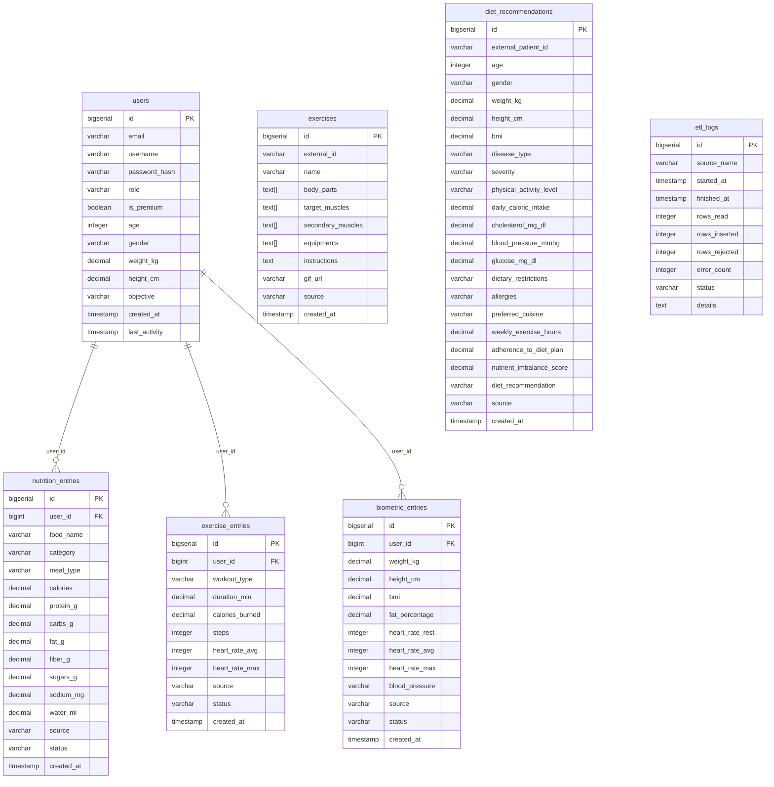

# MSPR HealthAI Coach - BDD

Microservice base de donnees PostgreSQL 16 pour la plateforme HealthAI Coach.

Ce depot est autonome et agnostique : il ne depend d'aucun autre microservice.
Il cree le reseau Docker `mspr_data_network` que les autres services (ETL, API, AUTH) peuvent rejoindre en tant que reseau externe.

## Demarrage

```bash
cp .env.example .env
# Editer .env avec vos valeurs
docker compose up -d
```

Le service est pret quand le healthcheck passe (`healthy`).

## Variables d'environnement

| Variable | Defaut | Description |
|----------|--------|-------------|
| `DB_NAME` | `healthai` | Nom de la base |
| `DB_USER` | `healthai_user` | Utilisateur PostgreSQL |
| `DB_PASSWORD` | `password` | Mot de passe (a changer) |
| `DB_PORT` | `5432` | Port expose sur l'hote |

## Migrations

Les migrations SQL sont dans `migrations/` et sont executees automatiquement au premier demarrage via `docker-entrypoint-initdb.d`.

| Fichier | Contenu |
|---------|---------|
| `V1__init_schema.sql` | Schema principal : users, exercises, nutrition_entries, exercise_entries, biometric_entries, etl_logs |
| `V2__diet_recommendations.sql` | Table diet_recommendations |
| `V3__add_unique_constraints.sql` | Contraintes d'unicite pour les ON CONFLICT |

## Reseau Docker

Ce compose cree le reseau `mspr_data_network`.
Pour connecter un autre microservice :

```yaml
networks:
  mspr_data_network:
    external: true
```

## Connexion directe

```
host: localhost
port: 5432 (configurable via DB_PORT)
database: healthai
```

## Schema de la base de donnees



Tables independantes (pas de FK) : `exercises`, `diet_recommendations`, `etl_logs`.
