# Modele de donnees

Ce document decrit le modele relationnel de la base `healthai` post-MSPR2 et justifie les choix structurels (suppression des FK `user_id`, usage de `JSONB`, strategie de cache LLM via `inputs_hash`).

Etat du schema : migrations `V1` a `V9` appliquees.

## 1. Diagramme ERD

```mermaid
erDiagram
    exercises {
        bigserial id PK
        varchar external_id UK
        varchar name
        text[] body_parts
        text[] target_muscles
        text[] secondary_muscles
        text[] equipments
        text instructions
        varchar gif_url
        varchar source
        timestamp created_at
    }
    nutrition_entries {
        bigserial id PK
        varchar food_name
        varchar category
        varchar meal_type
        decimal calories
        decimal cholesterol_mg
        decimal protein_g
        decimal carbs_g
        decimal carbsg
        decimal fat_g
        decimal fiber_g
        decimal sugars_g
        decimal sodium_mg
        decimal water_ml
        varchar source
        varchar status
        timestamp created_at
    }
    exercise_entries {
        bigserial id PK
        varchar workout_type
        decimal duration_min
        decimal calories_burned
        integer steps
        integer heart_rate_avg
        integer heart_rate_max
        varchar source
        varchar status
        timestamp created_at
    }
    biometric_entries {
        bigserial id PK
        decimal weight_kg
        decimal height_cm
        decimal bmi
        decimal fat_percentage
        integer heart_rate_rest
        integer heart_rate_avg
        integer heart_rate_max
        varchar blood_pressure
        integer age
        varchar gender
        integer experience_level
        varchar source
        varchar status
        timestamp created_at
    }
    diet_recommendations {
        bigserial id PK
        varchar external_patient_id UK
        integer age
        varchar gender
        decimal weight_kg
        decimal height_cm
        decimal bmi
        varchar disease_type
        varchar severity
        varchar physical_activity_level
        decimal daily_caloric_intake
        decimal cholesterol_mg_dl
        decimal blood_pressure_mmhg
        decimal glucose_mg_dl
        varchar dietary_restrictions
        varchar allergies
        varchar preferred_cuisine
        decimal weekly_exercise_hours
        decimal adherence_to_diet_plan
        decimal nutrient_imbalance_score
        varchar diet_recommendation
        varchar source
        timestamp created_at
    }
    etl_logs {
        bigserial id PK
        varchar source_name
        timestamp started_at
        timestamp finished_at
        integer rows_read
        integer rows_inserted
        integer rows_rejected
        integer error_count
        varchar status
        text details
    }
    meal_analyses {
        bigserial id PK
        bigint user_id
        varchar photo_url
        jsonb detected_foods
        jsonb macros
        jsonb confidence_scores
        jsonb recommendations
        timestamp created_at
    }
    meal_plans {
        bigserial id PK
        bigint user_id
        jsonb plan
        varchar objective
        jsonb constraints
        varchar inputs_hash
        timestamp generated_at
    }
    nutrition_goals {
        bigint user_id PK
        integer calories_target
        decimal protein_g
        decimal carbs_g
        decimal fat_g
        text[] allergies
        varchar diet_type
        varchar health_goal
    }
```

Aucune FK n'est materialisee entre les tables. Les tables MSPR1 (`exercises`, `nutrition_entries`, `exercise_entries`, `biometric_entries`, `etl_logs`, `diet_recommendations`) sont alimentees par l'ETL a partir de datasets Kaggle anonymises et restent independantes les unes des autres. Les tables MSPR2 (`meal_analyses`, `meal_plans`, `nutrition_goals`) sont reliees a un utilisateur via la colonne `user_id` (`BIGINT` opaque issu du JWT), sans contrainte referentielle puisque la table `users` a ete supprimee en V7.

## 2. Migrations MSPR2

| Migration | Table | Colonne | Type | Justification |
|-----------|-------|---------|------|---------------|
| V8 | `meal_analyses` | `id` | `BIGSERIAL PK` | Identifiant technique de l'analyse photo. |
| V8 | `meal_analyses` | `user_id` | `BIGINT NOT NULL` | Proprietaire de l'analyse, decode du JWT cote AI-Nutrition (pas de FK, cf. V7). |
| V8 | `meal_analyses` | `photo_url` | `VARCHAR(500)` | URL de la photo soumise (stockage externe). |
| V8 | `meal_analyses` | `detected_foods` | `JSONB NOT NULL DEFAULT '[]'` | Liste d'aliments reconnus par HuggingFace, structure libre (label + bbox + score). |
| V8 | `meal_analyses` | `macros` | `JSONB NOT NULL DEFAULT '{}'` | Macronutriments agreges (kcal, P/G/L), schema susceptible d'evoluer. |
| V8 | `meal_analyses` | `confidence_scores` | `JSONB NOT NULL DEFAULT '{}'` | Scores de confiance par aliment detecte. |
| V8 | `meal_analyses` | `created_at` | `TIMESTAMP NOT NULL DEFAULT NOW()` | Trace temporelle de l'analyse. |
| V8 | `meal_analyses` | _indexes_ | `(user_id)`, `(created_at DESC)` | Filtrage par utilisateur, tri chronologique. |
| V8 | `meal_plans` | `id` | `BIGSERIAL PK` | Identifiant technique du plan. |
| V8 | `meal_plans` | `user_id` | `BIGINT NOT NULL` | Beneficiaire du plan, decode du JWT. |
| V8 | `meal_plans` | `plan` | `JSONB NOT NULL DEFAULT '{}'` | Plan repas brut renvoye par le LLM (Ollama / Gemma3:4b), forme libre. |
| V8 | `meal_plans` | `objective` | `VARCHAR(100)` | Objectif declare par l'utilisateur, copie en clair pour faciliter le filtrage. |
| V8 | `meal_plans` | `constraints` | `JSONB NOT NULL DEFAULT '{}'` | Contraintes utilisateur (allergies, regime, budget, duree). |
| V8 | `meal_plans` | `generated_at` | `TIMESTAMP NOT NULL DEFAULT NOW()` | Trace temporelle de la generation. |
| V8 | `meal_plans` | _indexes_ | `(user_id)`, `(generated_at DESC)` | Filtrage par utilisateur, tri chronologique. |
| V8 | `nutrition_goals` | `user_id` | `BIGINT PK` | Une ligne par utilisateur, PK = `user_id` (relation 1-1). |
| V8 | `nutrition_goals` | `calories_target` | `INTEGER` | Cible calorique journaliere. |
| V8 | `nutrition_goals` | `protein_g`, `carbs_g`, `fat_g` | `DECIMAL(8, 2)` | Cibles macronutriments en grammes. |
| V8 | `nutrition_goals` | `allergies` | `TEXT[]` | Allergies declarees, tableau natif PostgreSQL. |
| V8 | `nutrition_goals` | `diet_type` | `VARCHAR(50)` | Regime alimentaire (vegan, halal, etc.). |
| V9 | `nutrition_goals` | `health_goal` | `VARCHAR(30) CHECK` | Objectif sante (`weight_loss`, `muscle_gain`, `balance`, `sport_performance`). `NULL` = comportement par defaut `balance`. |
| V9 | `meal_plans` | `inputs_hash` | `VARCHAR(64)` + index | Empreinte SHA256 des inputs canonicalises, cle de cache pour eviter de re-solliciter le LLM (cf. section 3.3). |
| V9 | `meal_analyses` | `recommendations` | `JSONB NOT NULL DEFAULT '[]'` | Recommandations textuelles produites par le LLM ou par la matrice de fallback. |

## 3. Justifications structurelles

### 3.1 Retrait des FK `user_id` (V7)

La table `users` initiale (V1) a ete supprimee en V7, et avec elle les FK `nutrition_entries.user_id`, `exercise_entries.user_id`, `biometric_entries.user_id`. Trois raisons :

- **Datasets sources anonymises.** Les CSV/JSON ingeres par l'ETL (ExerciseDB, Kaggle Nutrition, Gym Tracking, Diet Recommendations) ne partagent aucun identifiant utilisateur commun ; toutes les lignes inserees avaient `user_id = NULL`, rendant la FK inutile.
- **Authentification deportee.** L'identite est gouvernee par le service MSPR-AUTH (better-auth + JWT), sur une base PostgreSQL distincte. Maintenir une table `users` locale aurait duplique la source de verite.
- **Identite des nouvelles tables MSPR2.** `meal_analyses`, `meal_plans` et `nutrition_goals` portent un `user_id BIGINT` opaque, decode du JWT par le microservice AI-Nutrition (secret partage `BETTER_AUTH_SECRET`). Aucune FK n'est materialisee ; le couplage cross-base est evite.

### 3.2 Choix de `JSONB` pour les sorties LLM

Les colonnes `detected_foods`, `macros`, `confidence_scores`, `recommendations` (`meal_analyses`), `plan`, `constraints` (`meal_plans`) sont en `JSONB` plutot qu'en colonnes typees. Motivations :

- **Sortie LLM evolutive.** Le format de sortie d'Ollama / Gemma3:4b et des modeles HuggingFace est susceptible de changer (nouveaux champs, structures imbriquees, listes variables). Un schema rigide imposerait une migration a chaque iteration du prompt ou du modele.
- **Versionnement applicatif.** Le schema effectif est gouverne au niveau du microservice (Pydantic), versionnable sans toucher a la BDD.
- **Performance acceptable.** `JSONB` est indexable (GIN si besoin) et beneficie de la compression TOAST, sans le cout de parsing du `JSON` texte.

Les colonnes a forte valeur metier et a schema stable (`objective`, `health_goal`, `diet_type`) restent en `VARCHAR` pour benefier du typage et des contraintes `CHECK`.

### 3.3 Strategie de cache via `inputs_hash` (V9)

Les plans repas generes par LLM (Ollama / Gemma3:4b) ont un cout de generation eleve (latence + ressources). La colonne `meal_plans.inputs_hash VARCHAR(64)` indexee sert de cle de cache :

- **Canonicalisation des inputs** cote AI-Nutrition : objectif, allergies triees alphabetiquement, budget, regime, duree, regroupes en JSON canonique.
- **Hash SHA256** de cette representation -> chaine de 64 hex.
- **Lookup** : avant d'appeler le LLM, le service `SELECT plan FROM meal_plans WHERE inputs_hash = $1 LIMIT 1`. Si une ligne existe, le plan est reutilise tel quel.
- **Insertion** : un nouveau plan genere est ecrit avec son `inputs_hash`, alimentant le cache pour les requetes futures.
- **Cache global, partage entre utilisateurs.** `inputs_hash` n'inclut pas `user_id` : un plan genere pour l'utilisateur A peut etre reservi a l'utilisateur B avec des inputs equivalents. C'est intentionnel (les plans ne contiennent aucune donnee personnelle attachee au demandeur initial) et c'est ce qui rend le cache reellement efficace au-dela d'un seul compte.

Le cache est porte par la BDD (pas par Redis ou un cache applicatif) pour rester operationnel sans dependance supplementaire et survivre au redemarrage des microservices.
